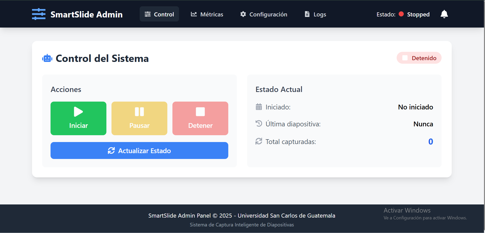
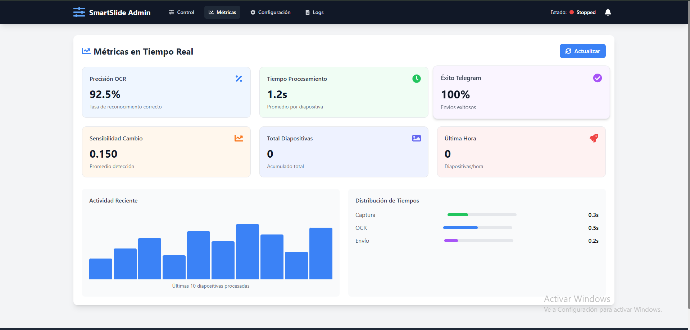
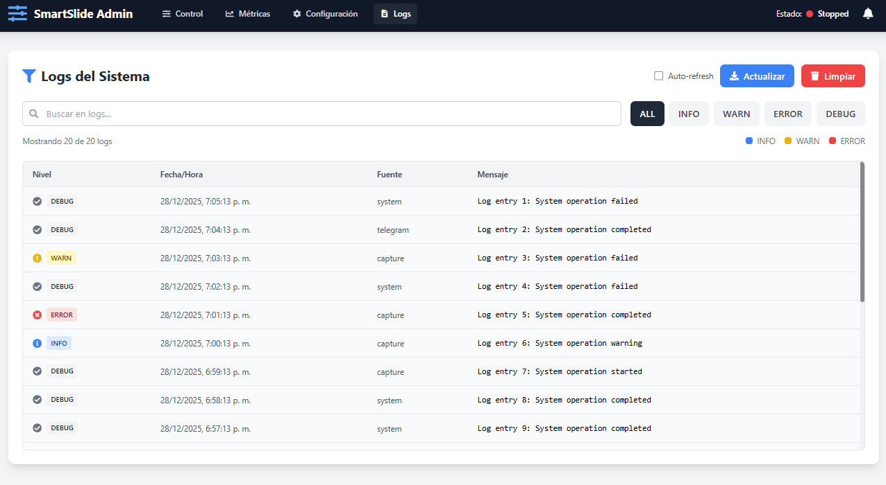

# Manual de usuario

Explica cómo encender la Raspberry Pi, preparar la cámara, iniciar SmartSlide y recibir las notificaciones en Telegram.

## Requisitos previos
- Raspberry Pi con cámara conectada (USB o CSI).
- Bot de Telegram creado y `configs/config.json` configurado con `telegram_bot_token` y `telegram_chat_id`.
- SmartSlide compilado o la posibilidad de ejecutar `go run` en la Pi.

## Encender y preparar la Raspberry Pi
1. Conecte la cámara y alimente la Raspberry Pi.
2. Abra una terminal.
3. Verifique la cámara:

```bash
ls /dev/video*
```

Si no aparece, revise la conexión o habilite la cámara con `raspi-config`.

## Configurar el bot de Telegram
1. Cree un bot con BotFather y anote el token.
2. Abre `configs/config.json` y coloca:

```json
{
  "telegram_bot_token": "TU_TOKEN_AQUI",
  "telegram_chat_id": 123456789
}
```

`telegram_chat_id` puede ser su ID personal o el ID de un grupo donde el bot esté presente.

## Iniciar SmartSlide
1. Ir al directorio del proyecto:

```bash
cd /ruta/al/proyecto
```

2. Ejecutar (si Go está instalado en la Pi):

```bash
go run ./cmd/smartslide
```

o ejecutar el binario compilado:

```bash
./smartslide
```

3. En la terminal verá mensajes sobre detecciones, OCR y envíos a Telegram.

## Qué recibirá en Telegram
- Foto anotada de la diapositiva (si fue detectada).
- Texto con el contenido extraído por OCR o un resumen breve.

Si no recibe mensajes, revise `configs/config.json` y los logs en la terminal.

## Comandos y controles
En este repositorio los comandos disponibles se definen en `internal/telegram/bot.go`.

## Problemas comunes y soluciones
- No llegan mensajes a Telegram: verificar `telegram_bot_token` y `telegram_chat_id`.
- La cámara no aparece: comprobar conexión física y `raspi-config`.
- OCR con muchos errores: mejorar iluminación, aumentar tamaño del texto o instalar paquetes de idioma de Tesseract.
- Rendimiento lento: reducir la resolución de captura o la frecuencia de procesamiento.

## Aplicacion 

Se tiene una aplicacion web para monitorear y configurar el funcionamiento del sistema.

### Control

Esta es la pantalla principal que tendra al iniciar el sistema aqui podra iniciar/reanudar, pausar y finalizar la ejecucion del sistema, ademas de poder ver en que estado se encuentra.



### Metricas

Aqui podra ver algunas metricas para evaluar el funcionamiento del sistema, como: la presicion del OCR, tiempo de procesamiento promedio de una diapositiva, el porcentaje de mensajes enviados correctamente por Telegram, sensibilidad al cambio, total de diapositivas analizadas, actividad reciente, y la distribucion del tiempo que se tarda el sistema en el analisis de diapositivas.



### Configuracion

En este apartado puede configurar la cantidad de fotogramas por segundo que se desean tomar, la sensibilidad para la deteccion de texto, el grupo o chat de telegram al que queremos que se envien los mensajes y el lenguaje que deseamos que reconozca.


### Logs

Aqui podemos ver mensajes sobre errores, advertencias y alguna informacion importante, se puede buscar logs especificos y filtrar entre los tipos de logs.

